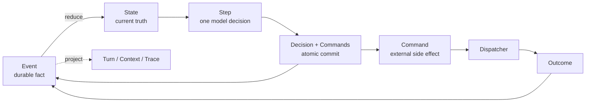

# helperMe

**A personal AI assistant whose behavior stays understandable as its capabilities grow.**

`helperMe` began with a recurring frustration: existing Agent assistants could do impressive work, but adapting them often meant changing one thing and disturbing several others. When a change did not take effect, it was difficult to tell whether the problem was in the prompt, the model, a tool, or the runtime. I could use those systems, but I did not truly own them.

This project explores a different goal: build an assistant for one person that can be understood, changed, verified, and continually shaped by that person. It is not a general-purpose Agent framework for unknown users.

> Capabilities may keep growing, but the system should remain small enough for one person to understand and control.

> [!WARNING]
> This repository is under active development. Future updates may introduce destructive changes to APIs, configuration, storage formats, or persisted data without a backward-compatible migration path. Back up any data you need before updating.

## What It Feels Like to Use

Start the console and give the assistant a task. It can inspect and modify files, run commands, and load external capabilities while keeping every important action in a durable execution history.

- Type a new instruction while it is working; it is durably appended to the same Session and becomes a later Step trigger.
- Exit and later resume a Session from its Journal-backed state.
- Connect MCP Servers without placing every external tool in the model context up front.
- Install and enable Skills, then let the model read their instructions only when needed.
- Keep workspace access, permissions, model decisions, and external side effects behind separate boundaries.

The result is a durable execution Session rather than a disposable chat connection: it can be inspected, interrupted, resumed, and extended without hiding how it advances.

## Why helperMe Is Different

### Traceable by construction

User messages, model decisions, tool outcomes, and explicit lifecycle requests are recorded as Events. Runtime State is deterministically rebuilt from those facts, so important behavior has an observable origin.

### Long-running work is not a conversation trick

A Turn is only the human-facing projection of an interaction. The durable unit is a Session, which can continue across multiple model Steps and be resumed after the process exits.

### Capabilities enter context only when needed

MCP Toolsets and Skills are progressively loaded. The model begins with small catalogs and loading entry points; a concrete capability becomes available only after its loading result has been committed. This keeps context growth explicit and recoverable.

## Quick Start

helperMe currently targets **Python 3.10+** and is developed and tested primarily on **Windows with PowerShell**.

```powershell
python -m venv .venv
.venv\Scripts\Activate.ps1
pip install -r requirements.txt
```

On the first launch, helperMe creates `~/.helperme/config.json` and asks you to edit it before restarting. No configuration setup command is required. Fill in the OpenAI-compatible Chat Completions endpoint, the workspace the assistant may access, and any enabled Channels:

```json
{
  "model": {
    "name": "your-model-name",
    "base_url": "https://your-model-endpoint.example/v1",
    "api_key": "your-api-key"
  },
  "workspace": {
    "root": "D:/work/agent",
    "full_access": true
  },
  "runtime": {
    "model_context_limit": 200000,
    "input_budget_ratio": 0.9
  },
  "channels": {}
}
```

Set `HELPERME_CONFIG` only when the complete configuration file should live at a non-default path. To use Telegram, fill in the bot token and leave `allowed_chat_id` as `null`, then run `python telegram_chat.py` and send `/start` to the bot. It reports the chat ID without accepting tasks; write that ID into the configuration and restart to enable the assistant.

Then start the console:

```powershell
python console_chat.py
```

The main console commands are:

| Command | Purpose |
|---|---|
| `/new` | Create a new Session |
| `/resume <session_id>` | Resume a Session from the Journal |
| `/mcp` | Inspect and manage MCP Servers |
| `/skill` | Inspect and manage Skills |

Typing normal text while the Agent is running appends another ordered `UserMessageReceived` to the current Session. `Ctrl+C` or `Ctrl+D` exits the program.

## Current Status

helperMe is a personal learning project under active development. Its architecture is deliberate, but its interfaces and storage formats should not yet be treated as stable public APIs.

Implemented today:

- Event / State / Step / Command Runtime with deterministic reduction.
- SQLite-backed Journal and recoverable Sessions.
- OpenAI-compatible Chat Completions model interface.
- File, command, Workspace, and permission boundaries.
- MCP discovery, management, resources, prompts, and on-demand Toolset loading.
- Skill installation, inspection, enabling, updating, and on-demand reading.
- Completion judgment and a Finalization Barrier for terminal states.

Planned, not yet implemented:

- SubAgent collaboration.
- Automation and scheduled execution.
- Long-term Memory.

The implementation order and current learning goals are tracked in the [Implementation Plan](docs/计划.md) and [Autonomous Agent Learning Plan](docs/自主Agent学习计划.md).

## Architecture in One Loop



The Journal is the sole durable execution truth. Runtime reduces facts, schedules Commands, enforces invariants, and finalizes terminal states. The model, an explicit Judge, or the user makes semantic decisions; those decisions return to the Journal as traceable facts.

```text
Event → State → Step → Command → Outcome → Event
```

Runtime does not know about MCP, Skills, plugins, or other product capabilities. Each kind of change enters through a narrow boundary aligned with its own reason to change. Architectural tests enforce those dependency boundaries rather than leaving them as conventions.

For the complete model, see the [Architecture Overview](docs/架构/总览.md) and [Runtime State Advancement Model](docs/架构/Runtime状态推进模型.md).

## Web and Browser Capabilities

helperMe does not maintain its own web search implementation or browser driver. These capabilities can be connected through MCP and loaded on demand. Current recommendations are [Tavily MCP](https://github.com/tavily-ai/tavily-mcp) for search and content extraction, and [Playwright MCP](https://github.com/microsoft/playwright-mcp) for browser interaction. Neither is a hard dependency.

## Tests

Run the architecture boundary tests with:

```powershell
python -m unittest tests.architecture.test_import_boundaries tests.architecture.test_runtime_boundaries
```

The repository also contains unit, integration, benchmark, and live tests grouped by subsystem. Tests under `tests/live` call the model endpoint configured in `~/.helperme/config.json` and may incur provider charges; run them deliberately rather than through broad test discovery.

## Further Reading

- [Documentation Index](docs/README.md)
- [Architecture Direction](docs/项目架构方向.md)
- [Architecture Overview](docs/架构/总览.md)
- [Runtime State Advancement Model](docs/架构/Runtime状态推进模型.md)
- [Implementation Plan](docs/计划.md)
